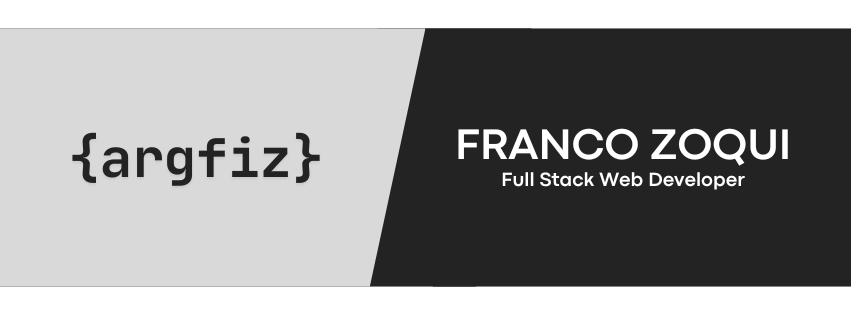

# 👋 Hi there!
I walk my path in web development with enthusiasm and dedication. My passion for self-improvement and my commitment to constant growth make me a motivated candidate willing to face new challenges.

## 📚 Full Stack Web Developer
I can work on Frontend and Backend, but I'm more enjoy working with the backend because I want to provide the highest possible performance applying modern technique

## 📕Tech Stack

## 🔗 Links

